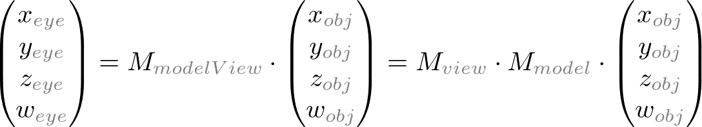
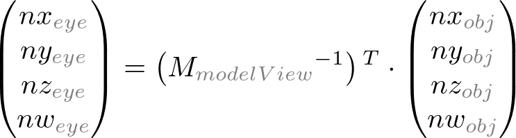
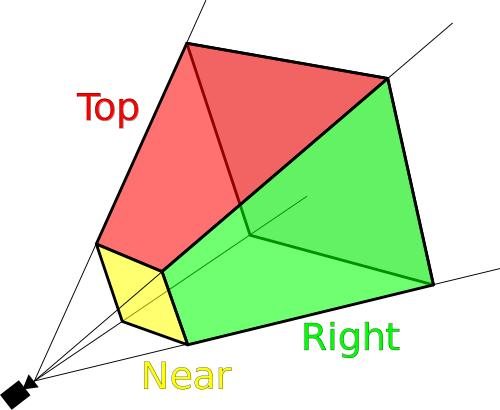

# OpenGL矩阵变换

### Overview
几何数据——顶点位置，和标准向量(normal vectors),在OpenGL 管道raterization 处理过程之前可通过顶点操作(Vertex Operation)和基本组合操作改变这些数据。

**重要的变换矩阵储存在 Model & View 矩阵中**


### Object Coordinates
对象的本地坐标系——任何变换之前的最初位置.为了变换(transformation)这些对象，可以调用glRotate(),glTranslatef(),glScalef()这些方法。

`glTranslate(x, y, z)` 移动object一定距离

`glRotate(theta, x, y, z)`About the ray from origin, 顺时针旋转一定方向

`glScale(x, y, z)` 放缩object一定比例

### Eye Coordinates
使用GL_MODELVIEW矩阵和Object坐标相乘所得。

在OpenGL中用GL_MODELVIEW将对象对象空间(Object Space)变换到视觉空间(eye space)。

矩阵是模型矩阵（Model Matrix）和视觉矩阵（View Matrix）的组合 (M_view * M_model)。

其中，**Model 变换指的是将Object Space转换到World Space. World Space指的是OpenGL中的三维空间。**

**而View 变换是将World space变换到eye space。**



注意：在OpenGL中没有单独的camera（view） matrix。因此，为了模拟camera或者view的变换，其中的场景(3D物体和光照）必须通过和view相反的方向变换。也就是说，OpenGL总是将camera定义在(0,0,0)点，并且强制在eye space坐标系的-Z轴方向,而且不能变换。

### Modeling Transformations
因为我们观察特定的model transformations 共享于多个模型之间，所以我们想避免连续reloading 相同sequence of transformations

Model View matrix 对于OpenGL保存 a stack of 矩阵

`glPushMatrix()`push所有stack中的矩阵往下一个level，然后复制最上面的矩阵

`glPopMatrix()`pop the matrix off the stack

`glMatrixMode(GL_MODELVIEW)`

```
glLoadIdentity()
glTranslatef(GLfloat x, y, z)
glRotatef(GLfloat degrees, x, y, z)
glScalef(GLfloat x, y, z)
glPushMatrix()
glPopMatrix()
```

### Normal Vector Transformation(标准向量变换)
标准向量(Normal vectors)——从对象坐标系(Object coordinates)变换到视觉坐标系(eye coordinates)，它是用来计算光照(lighting calculation)的.

注意:标准向量(Normal vectors)的变换和顶点的不同。其中视觉矩阵(view matrix)是GL_MODELVIEW逆矩阵的转置矩阵和标准向量（Normal vector是）相乘所得，即：




### Clip Coordinates

The eye coordinates are now multiplied with GL_PROJECTION matrix, and become the clip coordinates. 

GL_PROJECTION矩阵定义了可视的空间（view frustum 截头锥体,）以及顶点数据如何投影到屏幕上（视角或者正交化(orthogonal)）



它被称为剪切面坐标系的原因是（x,y,z)变换之后要和±w比较。


### Perspective Projection 
Projections implemented by projection matrix

`gluPerspective()` 创造一个perspective projection matrix

vfov: vertical field of view

aspect: window width/height

near, far: distance to near & far clipping planes

```python
glSetMatrix(GL_PROJECTION)
glLoadIdentity()  # load an identity matrix
gluPerspective(vfov, aspect, near, far)
```

GL_PROJECTION matrix is used to define the frustum. This frustum determines which objects or portions of objects will be clipped out. Also, it determines how the 3D scene is projected onto the screen. (Please see more details how to construct the projection matrix.)

OpenGL provides 2 functions for GL_PROJECTION transformation. glFrustum() is to produce a perspective projection, and glOrtho() is to produce a orthographic (parallel) projection. Both functions require 6 parameters to specify 6 clipping planes; left, right, bottom, top, near and far planes. 8 vertices of the viewing frustum are shown in the following image. 


### Normalized Device Coordinates 标准化设备坐标系(NDC)
It is yielded by dividing the clip coordinates by w. It is called perspective division. It is more like window (screen) coordinates, but has not been translated and scaled to screen pixels yet. The range of values is now normalized from -1 to 1 in all 3 axes. 


## References:

http://www.songho.ca/opengl/gl_transform.html
